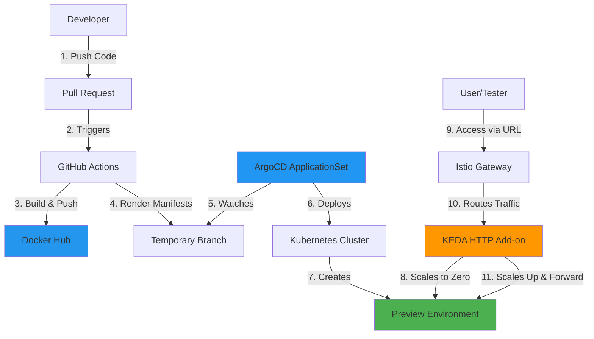
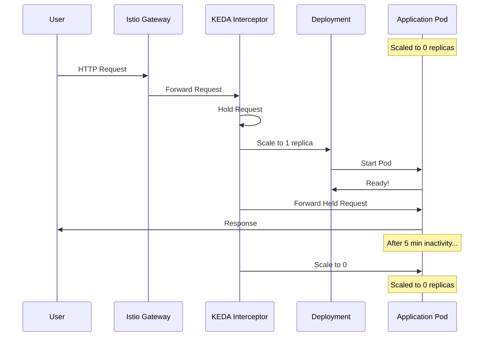
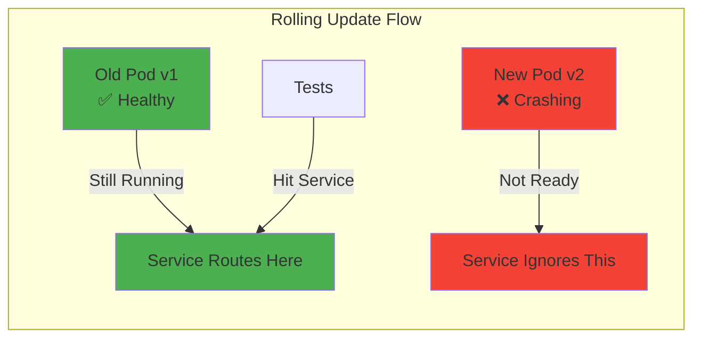
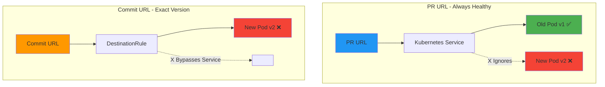
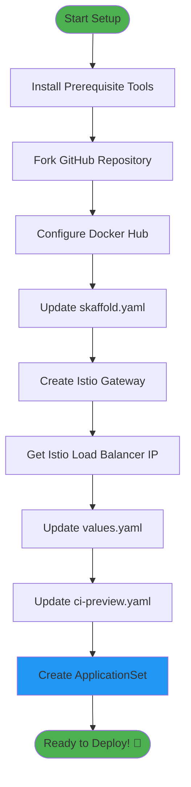
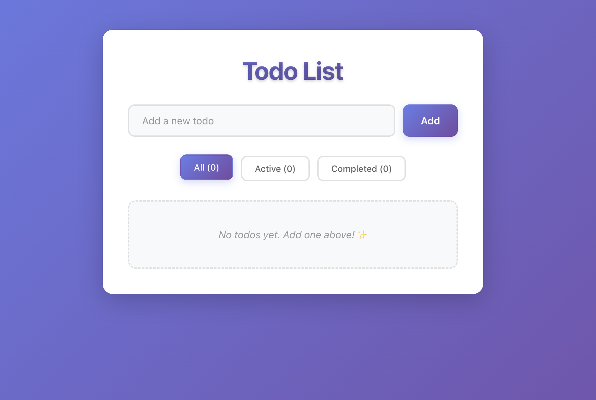
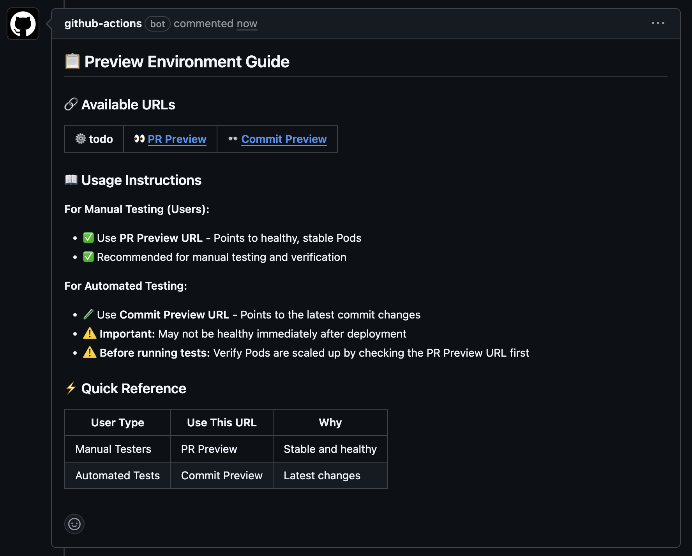
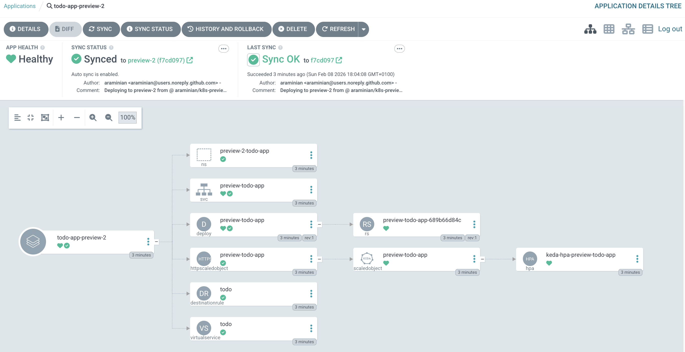
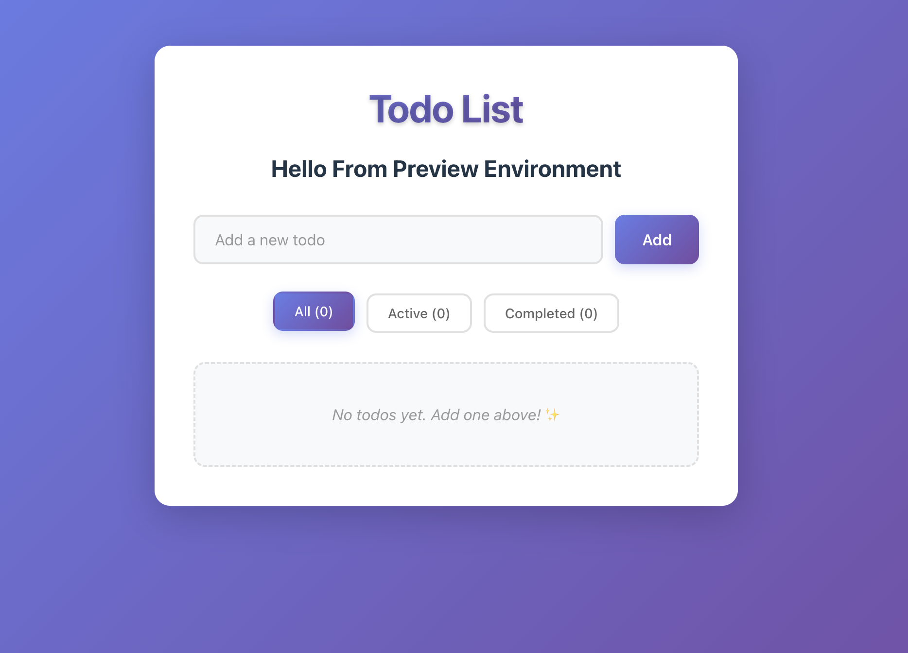

# Complete Guide to Preview Environment on Kubernetes

Welcome, fellow Kubernetes enthusiast! 👋

This guide is your companion piece to my KubeCon Amsterdam 2026 presentation. Think of it as the "extended director's cut" with all the scenes that didn't make it to the stage.

## What's This All About?

Picture this: You're a developer who just made some changes to the codebase. You open a Pull Request and... wait, wouldn't it be nice if you could actually *see* those changes running in a real environment before bothering your teammates with a review?

That's exactly what Preview Environments do! They're like temporary playgrounds where your code can stretch its legs before joining the big leagues (production).

Here's the cool part: these environments are smart enough to scale down to zero when nobody's using them. It's like having a light that automatically turns off when you leave the room, except this light costs actual money, so you'll definitely want it to turn off.

And yes, you can run integration tests against these environments too. Because manually clicking through your app is so 2015.

This guide is designed for local Kubernetes clusters like Minikube, but don't let that stop you—it'll work on any Kubernetes cluster that's willing to play along.

### The Big Picture

Here's how everything fits together:



## The Tools You'll Need (AKA The Shopping List)

Before we dive in, let's gather our tools. Think of this as assembling the Avengers, but for Kubernetes:

- **Kubernetes cluster** (Minikube, kind, etc.) - The stage where our drama unfolds
- **Helm** - The template wizard
- **Skaffold** - The automated build assistant (because manual builds are for cavemen)
- **ArgoCD** - The GitOps maestro
- **KEDA and HTTP Add-on** - The cost-saving heroes
- **Istio** - The traffic cop

### Kubernetes Cluster

I'm rolling with Minikube here—it's a lightweight Kubernetes cluster that lives happily on your laptop without consuming it like a black hole.

Grab it from the [Minikube website](https://minikube.sigs.k8s.io/docs/start), then summon your cluster with `make create-cluster`. Easy peasy.

### Helm

Helm is our go-to for installing KEDA and rendering those all-important manifests for preview environments. It's like a package manager, but for Kubernetes resources. Because nobody wants to write YAML by hand anymore (do they?).

Install it from the [Helm website](https://helm.sh/docs/intro/install/).

### Skaffold

Skaffold is basically your DevOps assistant that handles the boring stuff—building Docker images, rendering manifests, and deploying your app. It's automation at its finest.

Learn more at the [Skaffold documentation](https://skaffold.dev/docs/) and install it from the [Skaffold website](https://skaffold.dev/docs/install/).

### ArgoCD

ArgoCD is the star of our GitOps show. It watches your Git repository like a hawk and deploys whatever it finds there. No more "it works on my machine" excuses.

This is *the* critical piece for preview environments. Install it with `make install-argocd` and feel the GitOps power flow through you.

### KEDA and HTTP Add-on

KEDA is an event-driven autoscaler that's way cooler than it sounds. The HTTP Add-on is its sidekick that specifically handles HTTP traffic-based scaling.

Why do we need this? Because paying for idle preview environments is like leaving your car running in the parking lot all day—technically possible, but financially questionable.

Read up on [KEDA documentation](https://keda.sh/docs/latest/) and the [HTTP Add-on documentation](https://github.com/kedacore/http-add-on), then install with `make install-keda` and `make install-keda-http-addon`.

### Istio

Istio is our service mesh—think of it as a sophisticated traffic management system for your microservices. It's the bouncer that decides who gets in and where they go.

Minikube has an Istio add-on (how convenient!), which you can enable with `make enable-istio`. Or, if you're feeling adventurous, install it manually via the [Istio website](https://istio.io/latest/docs/setup/getting-started/).


## The Big Picture (Background and Context)

Alright, let's get into the nitty-gritty. Setting up preview environments isn't rocket science, but it does require answering a few important questions. Let's tackle them one by one, shall we?

### Question #1: How Do We Generate Kubernetes Manifests for Each Pull Request?

A Kubernetes manifest is basically a recipe written in YAML that tells Kubernetes what to cook up. It includes all the ingredients: Deployments, Services, Ingresses, and whatever else your app needs to run.

We're using Helm for this job. The Helm chart lives in `kubernetes/charts/todo-app` if you want to peek at it.

Here's the catch: each preview environment needs to be unique. We can't have two PRs fighting over the same namespace or trying to use the same URL. That would be chaos—like two people trying to park in the same spot.

So we use the PR number and commit ID to generate unique namespaces and URLs. Skaffold injects these values during the `render` step, and voilà—uniqueness achieved!

Here's what a preview namespace looks like:

```yaml
apiVersion: v1
kind: Namespace
metadata:
  name: preview-123-todo-app
```

See that `123`? That's the PR number. Simple, elegant, and no collisions!

### Question #2: How Do We Generate These Manifests Dynamically?

Here's the thing: we need fresh manifests every time someone pushes a new commit to a PR. Doing this manually would be like washing dishes by hand when you have a perfectly good dishwasher.

Enter GitHub Workflows! Our workflow handles three important tasks:
- Builds and pushes the Docker image to Docker Hub (because Docker images don't build themselves)
- Renders the Kubernetes manifests for the preview environment
- Pushes those manifests to GitHub in a temporary branch

You can find this workflow in `.github/workflows/ci-preview.yaml`. Feel free to snoop around!

### Question #3: How Do We Deploy the Manifests to Kubernetes?

Welcome to the GitOps philosophy: store your manifests in Git, and let a tool (ArgoCD) handle the deployment. It's like having a robot butler that watches your Git repo and automatically deploys whatever it finds.

For static environments like production or staging, we'd use ArgoCD `Application` resources. But for preview environments? That gets messy fast:
- Creating a new `Application` for every PR? Tedious.
- Deleting it when the PR closes? Error-prone.
- Automating all of this? Headache-inducing.

That's why we use `ApplicationSet` instead! It's like the `Application` resource's smarter sibling.

`ApplicationSet` provides generators that create `Application` resources dynamically. For more details, check out the [ArgoCD ApplicationSet documentation](https://argo-cd.readthedocs.io/en/stable/operator-manual/applicationset/).

We're using the `pullRequest` generator, which creates an `Application` for each open Pull Request. One `ApplicationSet` to rule them all! And when you merge or close the PR? The `Application` vanishes automatically. It's like magic, but with more YAML.

Here's a taste of what an `ApplicationSet` looks like:

```yaml
apiVersion: argoproj.io/v1alpha1
kind: ApplicationSet
metadata:
  name: todo-app-preview-environment
  namespace: argocd
spec:
  goTemplate: true
  syncPolicy:
    preserveResourcesOnDeletion: false
  generators:
  - pullRequest: # The magic generator
    # ArgoCD polls every requeueAfterSeconds to check for changes
      requeueAfterSeconds: 90 # Check every 90 seconds
      github:
        owner: araminian
        repo: k8s-preview
        labels:
        - preview # Only watch PRs with this label
  template:
    metadata:
      # {{.number}} gets replaced with the actual PR number
      name: todo-app-preview-{{.number}}
      labels:
        environment: preview
        app: todo-app
    spec:
      project: default
      source:
        directory:
          include: '{*.yml,*.yaml}'
          repoURL: https://github.com/araminian/k8s-preview.git
          # Deploy from the temporary branch for this PR
          targetRevision: preview-{{.number}}
```

The GitHub Action workflow automatically adds the `preview` label to PRs, so ArgoCD knows which ones to watch.

### Question #4: How Do We Keep This Cost-Effective?

Let's be real: preview environments sitting idle all day are expensive. Imagine having 100+ preview environments running 24/7 when developers only use them for a few hours per day. Your cloud bill would be scarier than a horror movie.

The solution? KEDA HTTP Add-on! It acts as a smart proxy that:

1. **When a request arrives:**
   - If the Deployment is scaled to zero, it scales it up *first*, then forwards the request
   - If the Deployment is already running, it just forwards the request

2. **When things go quiet:**
   - After a period of inactivity, it scales the Deployment back down to zero

It's like having lights that automatically turn off when you leave the room, except this saves you actual money!

Here's how the scaling flow works:



Here's what an `HTTPScaledObject` looks like:

```yaml
apiVersion: http.keda.sh/v1alpha1
kind: HTTPScaledObject
metadata:
  name: preview-todo-app
  namespace: preview-123-todo-app
spec:
  hosts:
    # KEDA identifies requests by this hostname
    - todo-123-pr.127.0.0.1.sslip.io
  replicas:
    max: 2 # Don't go crazy
    min: 0 # Scale to zero for maximum savings
  scaleTargetRef:
    apiVersion: apps/v1
    kind: Deployment
    name: preview-todo-app
    port: 80
    service: preview-todo-app
  scaledownPeriod: 300 # Wait 5 minutes before scaling down
  scalingMetric:
    requestRate:
      granularity: 1s
      targetValue: 1
      window: 1m
```

For the nitty-gritty details, check out the [KEDA HTTP Add-on Scaled Object documentation](https://github.com/kedacore/http-add-on/blob/main/docs/ref/v0.12.1/http_scaled_object.md?plain=1).

### Question #5: How Do We Actually Access These Environments?

Preview environments are accessible via Ingress. We're using Istio as our Ingress controller because it's powerful and makes us look smart at parties.

Now here's where it gets interesting: we provide *two* URLs for each preview environment:

- **PR URL**: Points to healthy, running Pods. This is for humans to click around and test things.
- **Commit URL**: Points to the latest commit, period. This is for automated tests that need to verify the exact code changes.

"Wait, why two URLs?" Great question! Let me tell you a story...

Here's the Istio `VirtualService` that powers our dual-URL setup:

```yaml
apiVersion: networking.istio.io/v1alpha3
kind: VirtualService
metadata:
  labels:
    app: todo-app
    app.kubernetes.io/instance: preview
    app.kubernetes.io/managed-by: Helm
    app.kubernetes.io/name: todo-app
    helm.sh/chart: todo-app-0.1.0
    pr_number: pr-123
    tier: preview
    version: 827f6a4
  name: todo
  namespace: preview-123-todo-app
spec:
  gateways:
    - istio-system/ingress-gateway
  hosts:
    # The PR URL - for human consumption
    - todo-123-pr.127.0.0.1.sslip.io
    # The Commit URL - for automated tests
    - todo-123-pr-827f6a4.127.0.0.1.sslip.io
  http:
    - match:
        - authority:
            prefix: todo-123-pr
      route:
        - destination:
            host: keda-add-ons-http-interceptor-proxy.keda-http-addon.svc.cluster.local
            port:
              number: 8080
    - match:
        - authority:
            prefix: todo-123-pr-827f6a4
      route:
        - destination:
            host: preview-todo-app
            port:
              number: 80
            subset: preview-827f6a4
```

The first route goes through KEDA's interceptor, which scales things up as needed. The second route? Straight to the specific commit version. No proxy, no scaling magic—just raw, unfiltered Pods.

### The Tale of Two URLs (Or: Why I'm Not Actually Crazy)

You might be wondering, "Why the heck do we need *two* URLs? Isn't one enough?"

Let me tell you a story. In our first iteration, we had only one URL—the PR URL. Life was simple. Birds were singing. Everything worked... until it didn't.

One fine day, we deployed to production and *boom*—the service started crashing. I frantically checked GitHub Actions: all green. Integration tests? Passing. What was going on?!

I reopened the merged PR and started digging. Turns out, one of the commits in the PR was causing the service to exit with a non-zero code. "But wait," I thought, "why did the integration tests pass?"

The answer? **Kubernetes rolling updates.**

Here's what happens during a rolling update:



When we deployed the broken commit, Kubernetes started a new Pod (v2) that immediately began crashing. But the old Pod (v1) was still happily running and serving traffic. Kubernetes only removes old Pods once the new ones are healthy. So all our tests were hitting the old, working version while the new version quietly crashed in the background.

Our setup could catch bugs in the *business logic*, but it completely missed errors that caused Pods to crash on startup. Not great, Bob.

**The Solution: Two URLs**



So we added the **Commit URL**. This URL points directly to the latest commit's Pods—healthy or not. If your code crashes, your tests will know about it immediately.

We use the Git short SHA in the URL (like `827f6a4`) to make each commit's URL unique. It changes with every push, so you're always testing the exact code you just committed.

To make this work, we use Istio's `DestinationRule` to create subsets based on Pod labels:

```yaml
apiVersion: networking.istio.io/v1alpha3
kind: DestinationRule
metadata:
  name: todo
  namespace: preview-123-todo-app
spec:
  host: preview-todo-app
  subsets:
    - labels:
        # Match Pods with this version label
        version: 827f6a4
      # This is the subset name we use in routing
      name: preview-827f6a4
```

With this setup, requests to the Commit URL go straight to Pods labeled with that specific version. No guessing, no "maybe it'll route to the old Pod." Just certainty.

For more on `DestinationRule`, check out the [Istio DestinationRule documentation](https://istio.io/latest/docs/reference/config/networking/destination-rule/).

And that, my friends, is why we have two URLs. The PR URL is for humans to browse around, and the Commit URL is for tests that need to verify the *actual* changes. Problem solved, production saved, and I get to keep my job!

## Let's Actually Build This Thing!

Time to get our hands dirty! Here's your checklist:



- [ ] Install all the prerequisite tools (check the shopping list above)
- [ ] Fork the GitHub repository
- [ ] Set up Docker Hub and configure `DOCKERHUB_USERNAME` and `DOCKERHUB_TOKEN` secrets
- [ ] Update `skaffold.yaml` with your Docker registry
- [ ] Create an Istio Gateway
- [ ] Update `values.yaml` with the Istio load balancer IP
- [ ] Update `ci-preview.yaml` with the Istio load balancer IP
- [ ] Create the `ApplicationSet` resource

Don't worry—we'll walk through each step together. You've got this!

### Fork the GitHub Repository

Hit that `Fork` button in the top right corner of this repository. It's like adopting a puppy, but with less responsibility and more YAML.

This repo includes a simple TODO app, but you can swap in your own application. Just replace the Dockerfile and tweak the Helm chart to match your needs.

### Configure Docker Hub

You'll need a free Docker Hub account because we're pushing images there. Sign up at the [Docker Hub website](https://docs.docker.com/accounts/create-account/).

Next, create a Personal Access Token (PAT) with `read` and `write` permissions. This lets GitHub Actions push images without exposing your password (because security matters, even in tutorials).

Add these secrets to your GitHub repository:
- `DOCKERHUB_USERNAME`
- `DOCKERHUB_TOKEN`

Check out the [GitHub Actions documentation](https://docs.github.com/en/actions/how-tos/write-workflows/choose-what-workflows-do/use-secrets) if you need help with secrets.

### Update `skaffold.yaml`

Open up `skaffold.yaml` and point it to your Docker registry:

```yaml
build:
  artifacts:
    - image: your-docker-image-registry/todo-app
      platforms:
        - linux/amd64
        - linux/arm64
```

Replace `your-docker-image-registry` with your actual registry. Yes, that means typing your username. I know, it's exhausting.

### Create an Istio Gateway

We need a gateway so traffic can actually reach our preview environments. Think of it as the front door to your cluster.

```bash
make create-istio-gateway
```

Easy mode engaged!

### Update `values.yaml` and `ci-preview.yaml` with the Istio Load Balancer IP

To access preview environments, we need the Istio Ingress Gateway's IP address. Minikube makes this easy with the `minikube tunnel` command (which you should keep running in a terminal—think of it as watering a plant that needs constant attention).

Get the IP:

```bash
kubectl get svc -n istio-system istio-ingressgateway -o jsonpath='{.status.loadBalancer.ingress[0].ip}'
```

Update `values.yaml`:

```yaml
istioLoadBalancerIP: "YOUR_ISTIO_INGRESS_GATEWAY_IP"
```

And `ci-preview.yaml`:

```yaml
istio_load_balancer_ip: "YOUR_ISTIO_INGRESS_GATEWAY_IP"
```

Pro tip: Copy-paste is your friend here. Nobody likes typos in IP addresses.

### Create the ApplicationSet Resource

This is the piece that makes ArgoCD watch for Pull Requests and automatically deploy preview environments.

```bash
make create-application-set
```

The command will ask for your GitHub repository details (`OWNER` and `REPO`). Just answer honestly—it's not a trick question.

Want to see ArgoCD in action? Access the UI:

```bash
make access-argocd
```

This will give you the username and password. Head over to http://localhost:8080 and bask in the GitOps glory!

## Taking It for a Spin

Time for the fun part—creating a Pull Request and watching the magic happen!

The TODO app I've included looks like this:



Now let's make a change. Open `src/components/Heading.jsx` and spice things up:

```js
function Heading() {
    return (
        <div className="heading">
            <h1>Todo List</h1>
            <h2>Hello From Preview Environment</h2>
        </div>
    )
}
```

Commit your changes, push them to GitHub, and watch as the GitHub Actions workflow springs into action. It's like a Rube Goldberg machine, but for DevOps.

Shortly after, you'll see a comment on your PR with the **PR URL** and **Commit URL**:



**Important:** Keep `minikube tunnel` running in the background, or you'll be staring at a "connection refused" error wondering what went wrong. (Spoiler: the tunnel is what went wrong.)

Now let's check ArgoCD! You should see a new `Application` resource for your PR. It might take up to 90 seconds to appear—ArgoCD isn't *instant*, but it's close.



Notice something? There are no Pods running! KEDA has already scaled everything down to zero because nobody's using it yet. Cost savings in action!

Let's verify with kubectl (my PR number is 2):

```bash
kubectl get pods -n preview-2-todo-app
No resources found in preview-2-todo-app namespace.
```

Yep, totally empty. Now open the **PR URL** in your browser. KEDA's HTTP interceptor will hold the request while it wakes up your Deployment, then forward the traffic once everything's ready. It's like a very polite bouncer who asks you to wait while they unlock the door.

And there it is—our changes running in the preview environment!



Want to verify the exact commit version? Open the **Commit URL** in your browser. In most cases, both URLs point to the same Pods, but it's nice to know you can check the specific version if needed.

Now here's the cool part: walk away for a few minutes. Seriously, go make some coffee. When you come back and check the Pods:

```bash
kubectl get pods -n preview-2-todo-app -w 
NAME                                READY   STATUS    RESTARTS   AGE
preview-todo-app-689b66d84c-bnrjs   2/2     Running   0          5m37s
preview-todo-app-689b66d84c-bnrjs   2/2     Terminating   0          6m6s
preview-todo-app-689b66d84c-bnrjs   2/2     Terminating   0          6m7s
preview-todo-app-689b66d84c-bnrjs   0/2     Completed     0          6m12s
preview-todo-app-689b66d84c-bnrjs   0/2     Completed     0          6m13s
preview-todo-app-689b66d84c-bnrjs   0/2     Completed     0          6m13s

kubectl get pods -n preview-2-todo-app
No resources found in preview-2-todo-app namespace.
```

KEDA scaled it back down to zero! Your cloud bill just thanked you. Isn't that cool?

When you merge or close the PR, ArgoCD automatically removes the `Application` resource, and the GitHub Actions workflow deletes the temporary branch. It's like the preview environment never existed—except for all the bugs you caught before they reached production.

## What's Next?

Congrats! You've got preview environments running. Now you can adapt this setup for your own applications.

You might notice we haven't added automated tests yet. That's your homework! Here's what you'll need to do:

- [ ] Ensure your GitHub Runner can access the preview environment (consider using hosted runners)
- [ ] Send an initial request to the preview environment to trigger KEDA to scale up the Deployment
- [ ] Run a wait-for-availability check against the **Commit URL** to ensure the Pods are ready
- [ ] Once everything's healthy, unleash your test suite!

This ensures your tests run against the exact commit you pushed, not some stale version that's hanging around.

---

**And that's a wrap!** You've now got a solid foundation for preview environments on Kubernetes. Go forth and preview all the things! 🚀

If you have any questions or feedback, feel free to say hi (or complain about how much YAML you had to write—I feel your pain).
